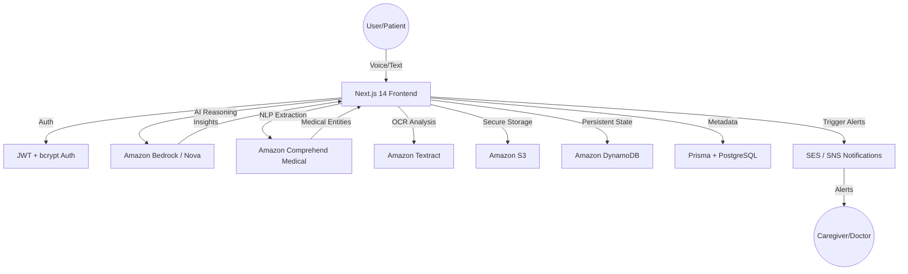

<div align="center">

<!-- ANIMATED HEADER -->


<!-- LANGUAGE TOGGLE -->
[ 🇬🇧 English ](README.md) | [ 🇯🇵 日本語 ](README_JP.md)

<br />

<!-- TECH BADGES -->
[](https://nextjs.org/)
[](https://react.dev/)
[](https://www.typescriptlang.org/)
[](https://aws.amazon.com/bedrock/)
[](https://aws.amazon.com/dynamodb/)
[](https://www.postgresql.org/)
[](https://www.prisma.io/)

<br />


<br />

<p>
  <b>Mimamori AI</b> is a proactive healthcare monitoring platform that bridges the <b>Clinical Data Gap</b> between patient visits. By transforming natural voice logs into <b>doctor-ready clinical insights</b>, it empowers patients and provides peace of mind to caregivers through real-time AI synthesis and smart alerts.
</p>

<br />

<!-- ACTION BUTTONS -->
[](https://mimamori-ai.com/)
[](https://github.com/shafayatsaad/mimamori)
[](https://builder.aws.com/content/3AAMRb7lRzAJnleldfYBBtfM1WG/aideas-transforming-healthcare-into-ai-powered-wellness-companion)

</div>

---

## 📋 Table of Contents

- [🎯 Overview](#-overview)
- [🚨 The Clinical Data Gap](#-the-clinical-data-gap)
- [✨ Key Features](#-key-features)
- [🧠 AI & Machine Learning Depth](#-ai--machine-learning-depth)
- [🛡️ Security & Data Privacy](#️-security--data-privacy)
- [🏗️ System Architecture](#️-system-architecture)
- [🛠️ Tech Stack](#️-tech-stack)
- [📖 Use Cases](#-use-cases)
- [🚀 Getting Started](#-getting-started)
- [🗺️ Roadmap](#️-roadmap)
- [👥 Team](#-team)

---

## 🎯 Overview

**Mimamori** (meaning "watching over" in Japanese) was built to transform how chronic conditions and daily wellness are monitored. Developed using **AWS Bedrock** and **Kiro IDE**, the platform ensures that the 99.9% of time patients spend outside of clinics is no longer a data "black box."

### Why Mimamori?

- 🎙️ **Voice-First**: Log symptoms naturally without the friction of typing.
- 🧠 **Medical Intelligence**: Extract clinical entities using Amazon Comprehend Medical.
- 🔔 **Proactive Safety**: Receive smart alerts when health trends show signs of deterioration.
- 👨‍👩‍👧 **Care Circle**: Seamlessly connect family, caregivers, and doctors on a single dashboard.

---

## 🚨 The Clinical Data Gap

Modern healthcare is often episodic and reactive. Patients spend over 8,700 hours a year outside clinical settings—hours where vital health data is lost. Mimamori solves this:

| Problem | Impact | Mimamori Solution |
|---------|--------|-------------------|
| ❌ **Episodic Care** | Critical symptoms missed between visits | **Continuous Logging** via voice |
| ❌ **Recall Bias** | Patients struggle to articular symptoms to doctors | **Synthesized PDF Reports** |
| ❌ **Caregiver Isolation** | Family members lack real-time visibility | **Shared Care Circle Dashboard** |
| ❌ **Unstructured Data** | Health diaries are messy and hard to analyze | **Comprehend Medical NLP Extraction** |

---

## ✨ Key Features

| Feature | Description |
|---------|-------------|
| 🗣️ **Voice Symptoms Log** | AI-powered voice capture that understands colloquial nuances and non-linear speech. |
| 🧬 **Clinical Synthesis** | Automated extraction of medications, conditions, dosages, and vitals using medical-grade NLP. |
| 📑 **Doctor-Ready Reports** | Comprehensive PDF health summaries with longitudinal trend visualizations and anomaly detection. |
| ⚠️ **Smart Alerts** | Real-time notifications for pulse/oxygen anomalies or worsening symptom trends using SNS/SES. |
| 🛡️ **Health Vault** | Secure, encrypted storage for lab reports and medical prescriptions with OCR parsing via Textract. |
| 🤝 **Care Circle** | Granular permission settings to share health updates with family and medical teams. |

---

## 🧠 AI & Machine Learning Depth

Mimamori leverages a multi-model orchestration strategy to ensure clinical accuracy:

### 1. Natural Language Processing (NLP)
We use **Amazon Comprehend Medical** to parse unstructured voice-to-text logs. This allows us to identify:
*   **PHM (Personal Health Metadata)**: Medications and dosages.
*   **Anatomical Identifiers**: Locations of pain or discomfort.
*   **Standardized Medical Codes**: Mapping to ICD-10 or RxNorm for professional review.

### 2. Large Language Models (LLM)
**Amazon Bedrock (Nova Pro/Micro)** serves as our primary reasoning engine. It:
*   Synthesizes days/weeks of logs into concise summaries.
*   Performs sentiment analysis to detect changes in a patient's emotional well-being—a key indicator for physical health decline.
*   Triages entries to determine if they require immediate "Care Circle" alerts.

---

## 🛡️ Security & Data Privacy

Patient data is treated with the highest level of security:

*   **Encryption at Rest**: All sensitive health data in **DynamoDB** and **S3** is encrypted using AWS KMS.
*   **HIPAA Alignment**: Architecture designed with HIPAA principles in mind, ensuring data isolation and audit trails.
*   **Secure Auth**: Secure custom authentication system using **bcrypt** for password hashing and stateless **JWT (jose)** tokens stored in `httpOnly` cookies.
*   **Stateless Processing**: Personal Health Information (PHI) is processed dynamically and sanitized for AI model prompts.

---

## 🏗️ System Architecture



---

## 🛠️ Tech Stack

| Layer | Technology | Purpose |
|-------|------------|---------|
| **Frontend** | Next.js 14 (App Router) | High-performance, SEO-friendly framework |
| **Styling** | Tailwind CSS + Custom CSS | Glassmorphism & premium UI/UX |
| **Animation** | Framer Motion | Smooth interactions and dynamic transitions |
| **AI Layer** | Amazon Bedrock (Nova) | Reasoning, Summarization & Sentiment Analysis |
| **Clinical NLP** | Amazon Comprehend Medical | Medical Ontology Extraction |
| **OCR Layer** | Amazon Textract | Smart medical document parsing |
| **Database** | DynamoDB + Prisma (PostgreSQL) | Scalable state & relational metadata |
| **Auth** | bcrypt + JWT (jose) | Secure cookie-based identity management |
| **Messaging** | Amazon SES / SNS | Instant multi-channel notifications |

---

## 📖 Use Cases

### 1. Chronic Condition Management
Patients with COPD, CHF, or Diabetes can log daily vitals naturally. Mimamori tracks the "delta"—the change over time—that doctors need but patients often forget.

### 2. Post-Surgical Recovery
Track recovery progress and early signs of infection or complications. The AI detects subtle language changes that might signal distress or worsening pain levels.

### 3. Elderly Independent Living
Allows seniors to live independently while keeping their family informed. "Smart Alerts" act as a safety net if a daily log is missed or shows concerning trends.

---

## 🚀 Getting Started

### Prerequisites

- Node.js 18+
- AWS Account (IAM permissions for Bedrock, DynamoDB, S3)
- Prisma CLI installed globally

### Installation

```bash
# Clone the repository
git clone https://github.com/shafayatsaad/mimamori.git
cd mimamori

# Install dependencies
npm install

# Setup environment variables
cp .env.example .env.local
```

### Environment Configuration

Configure your `.env.local` based on `.env.example`. Key variables include:
```env
# AWS & Infrastructure Configuration
APP_REGION=us-west-2
APP_S3_BUCKET_NAME=your_s3_bucket_name
APP_SES_FROM_EMAIL=your_verified_sender_email
APP_BEDROCK_ROUTER_ARN=your_bedrock_router_arn
MIMAMORI_USERS_TABLE=your_users_table_name
MIMAMORI_DATA_TABLE=your_data_table_name

# Relational Database Configuration
POSTGRES_PRISMA_URL=your_postgres_prisma_url_with_pooling
POSTGRES_URL_NON_POOLING=your_postgres_direct_url

# Authentication / Session
SESSION_JWT_SECRET=your_jwt_signing_secret
```

### Development

```bash
# Initialize database
npx prisma generate
npx prisma db push

# Run development server
npm run dev
```

### ☁️ Deployment (Vercel)

Mimamori is configured to be deployed easily on Vercel or any other Next.js-compatible hosting platform. 

1. **Connect Repository**: Import the GitHub repository into your Vercel dashboard.
2. **Setup Postgres Database**: In Vercel, navigate to the Storage tab and create a **Vercel Postgres** database. This will automatically populate the `POSTGRES_PRISMA_URL` and `POSTGRES_URL_NON_POOLING` environment variables.
3. **AWS & App Environment Variables**: Add the required environment variables in the Vercel Environment Variables section:
   - `APP_ACCESS_KEY_ID`: Your AWS IAM User access key.
   - `APP_SECRET_ACCESS_KEY`: Your AWS IAM User secret key.
   - `APP_REGION`: e.g., `us-west-2`
   - `APP_S3_BUCKET_NAME`: Your S3 bucket name.
   - `APP_SES_FROM_EMAIL`: Your verified SES sender email.
   - `APP_BEDROCK_ROUTER_ARN`: Your Bedrock prompt router ARN.
   - `MIMAMORI_USERS_TABLE`: Your DynamoDB users table name.
   - `MIMAMORI_DATA_TABLE`: Your DynamoDB health data table name.
   - `SESSION_JWT_SECRET`: Secret used to sign JWT session tokens.
4. **Deploy**: Vercel will automatically run the build command (`prisma generate && next build`) and deploy the application.

---

## 🗺️ Roadmap

- [ ] **Wearable Integration**: Direct sync with Apple HealthKit and Google Fit.
- [ ] **Smart Home Voice Skill**: Native Alexa and Google Home versions for hands-free logging.
- [ ] **Pharmacological Interaction Alerts**: AI-driven warnings for potential drug-drug interactions.
- [ ] **Clinician Dashboard**: A specialized web-view tailored specifically for GP/Specialist workflow integration.

---

## 👥 Team

<div align="center">
<table>
<tr>
<td align="center">
  <a href="https://github.com/shafayatsaad">
    
    <br />
    <strong>Shafayat Saad</strong>
  </a>
  <br />
  <sub>Full-Stack Developer & AI Architect</sub>
  <br /><br />
  <a href="https://github.com/shafayatsaad">
    
  </a>
  <a href="https://www.linkedin.com/in/shafayatsaad/">
    
  </a>
</td>
</tr>
</table>
</div>

---

<div align="center">

<!-- FOOTER -->


**Developed with ❤️ for the AIdeas Healthcare Hackathon**

[](https://mimamori-ai.com/)

</div>
