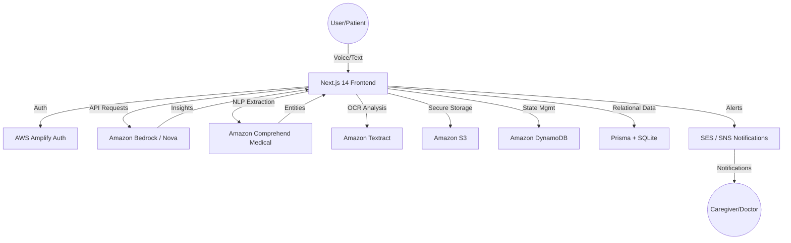

<div align="center">

<!-- ANIMATED HEADER -->


<!-- LANGUAGE TOGGLE -->
[ 🇬🇧 English ](README.md) | [ 🇯🇵 日本語 ](README_JP.md)

<br />

<!-- TECH BADGES -->
[](https://nextjs.org/)
[](https://react.dev/)
[](https://www.typescriptlang.org/)
[](https://aws.amazon.com/bedrock/)
[](https://aws.amazon.com/dynamodb/)
[](https://www.prisma.io/)

<br />

<p>
  <b>Mimamori AI</b> is a proactive healthcare monitoring platform that bridges the <b>Clinical Data Gap</b> between patient visits. By transforming natural voice logs into <b>doctor-ready clinical insights</b>, it empowers patients and provides peace of mind to caregivers through real-time AI synthesis and smart alerts.
</p>

<br />

<!-- ACTION BUTTONS -->
[](https://mimamori-ai.com/)
[](https://github.com/shafayatsaad/mimamori)
[](https://builder.aws.com/content/3AAMRb7lRzAJnleldfYBBtfM1WG/aideas-transforming-healthcare-into-ai-powered-wellness-companion)

</div>

---

## 📋 Table of Contents

- [🎯 Overview](#-overview)
- [🚨 The Clinical Data Gap](#-the-clinical-data-gap)
- [✨ Key Features](#-key-features)
- [🏗️ System Architecture](#️-system-architecture)
- [🛠️ Tech Stack](#️-tech-stack)
- [🚀 Getting Started](#-getting-started)
- [🤖 AI Agent Ecosystem](#-ai-agent-ecosystem)
- [👥 Team](#-team)

---

## 🎯 Overview

**Mimamori** (meaning "watching over" in Japanese) was built to transform how chronic conditions and daily wellness are monitored. Developed using **AWS Bedrock** and **Kiro IDE**, the platform ensures that the 99.9% of time patients spend outside of clinics is no longer a data "black box."

### Why Mimamori?

- 🎙️ **Voice-First**: Log symptoms naturally without the friction of typing.
- 🧠 **Medical Intelligence**: Extract clinical entities using Amazon Comprehend Medical.
- 🔔 **Proactive Safety**: Receive smart alerts when health trends show signs of deterioration.
- 👨‍👩‍👧 **Care Circle**: Seamlessly connect family, caregivers, and doctors on a single dashboard.

---

## 🚨 The Clinical Data Gap

Modern healthcare is often episodic and reactive. Mimamori solves the critical disconnects in current care models:

| Problem | Impact | Mimamori Solution |
|---------|--------|-------------------|
| ❌ **Episodic Care** | Critical symptoms missed between visits | **Continuous Logging** via voice |
| ❌ **Recall Bias** | Patients struggle to articular symptoms to doctors | **Synthesized PDF Reports** |
| ❌ **Caregiver Isolation** | Family members lack real-time visibility | **Shared Care Circle Dashboard** |
| ❌ **Unstructured Data** | Health diaries are messy and hard to analyze | **Comprehend Medical NLP Extraction** |

---

## ✨ Key Features

| Feature | Description |
|---------|-------------|
| 🗣️ **Voice Symptoms Log** | AI-powered voice capture that understands colloquial nuances. |
| 🧬 **Clinical Synthesis** | Automated extraction of medications, conditions, and vitals. |
| 📑 **Doctor-Ready Reports** | Comprehensive PDF health summaries with trend visualizations. |
| ⚠️ **Smart Alerts** | Real-time notifications for pulse/oxygen anomalies or worsening trends. |
| 🛡️ **Health Vault** | Encrypted storage for lab reports and medical prescriptions via Textract. |
| 🤝 **Care Circle** | Transparent health monitoring for the entire patient support network. |

---

## 🏗️ System Architecture



---

## 🛠️ Tech Stack

| Layer | Technology | Purpose |
|-------|------------|---------|
| **Frontend** | Next.js 14 (App Router) | Core Application Framework |
| **Logic** | React 18 + TypeScript | Component & State Logic |
| **Styling** | Tailwind CSS | Modern Glassmorphism UI |
| **Animation** | Framer Motion | Smooth Transitions & Micro-interactions |
| **AI Engine** | Amazon Bedrock (Nova Micro/Pro) | Primary LLM Reasoning |
| **Medical NLP** | Amazon Comprehend Medical | Clinical Entity Extraction |
| **Document AI** | Amazon Textract | Medical Document OCR |
| **Databases** | DynamoDB + Prisma (SQLite) | Data Persistence |
| **Messaging** | Amazon SES / SNS | Smart Alerts & Notifications |

---

## 🚀 Getting Started

### Prerequisites

- Node.js 18+
- AWS Account (Bedrock, DynamoDB access)
- Prisma CLI

### Installation

```bash
# Clone the repository
git clone https://github.com/shafayatsaad/mimamori.git
cd mimamori

# Install dependencies
npm install

# Setup environment variables
cp .env.example .env.local
```

### Development

```bash
# Generate Prisma Client
npx prisma generate

# Run the dev server
npm run dev
```

_The application will be available at `http://localhost:3000`_

---

## 🤖 AI Agent Ecosystem

Mimamori utilizes a multi-agent orchestrated system:

1. **Diary Agent**: Captures and routes voice logs to appropriate handlers.
2. **Clinical Extraction Agent**: Uses Comprehend Medical to structure raw text into medical ontologies.
3. **Alert Specialist**: Correlates daily vitals against baseline thresholds to trigger SNS alerts.
4. **Synthesis Agent**: Generates professional summaries for clinical review.

---

## 👥 Team

<div align="center">
<table>
<tr>
<td align="center">
  <a href="https://github.com/shafayatsaad">
    
    <br />
    <strong>Shafayat Saad</strong>
  </a>
  <br />
  <sub>Full-Stack Developer</sub>
  <br /><br />
  <a href="https://github.com/shafayatsaad">
    
  </a>
  <a href="https://www.linkedin.com/in/shafayatsaad/">
    
  </a>
</td>
</tr>
</table>
</div>

---

<div align="center">

<!-- FOOTER -->


**Developed with ❤️ for the AIdeas Healthcare Hackathon**

[](https://mimamori-ai.com/)

</div>
