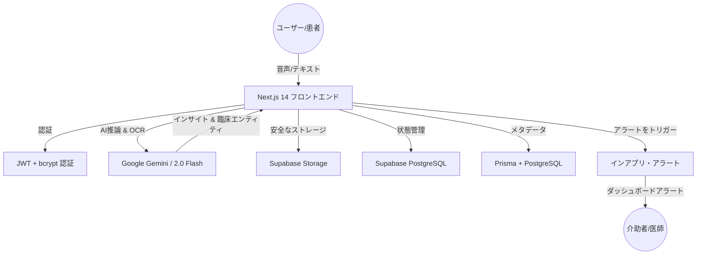

<div align="center">

<!-- アニメーションヘッダー -->


<!-- 言語切り替え -->
[ 🇬🇧 English ](README.md) | [ 🇯🇵 日本語 ](README_JP.md)

<br />

<!-- テクノロジーバッジ -->
[](https://nextjs.org/)
[](https://react.dev/)
[](https://www.typescriptlang.org/)
[](https://deepmind.google/technologies/gemini/)
[](https://supabase.com/)
[](https://www.postgresql.org/)
[](https://www.prisma.io/)

<br />


<br />

<p>
  <b>Mimamori AI</b> は、診察の合間に生じる<b>「臨床データの空白（Clinical Data Gap）」</b>を埋める、プロアクティブなヘルスケア・モニタリングプラットフォームです。日常の音声ログを<b>医師が活用可能な臨床的インサイト</b>に変換し、リアルタイムのAI合成とスマートインアプリ・アラートを通じて、患者の自己管理を支援し、介助者に安心を提供します。
</p>

<br />

<!-- アクションボタン -->
[](https://mimamori-ai.com/)
[](https://github.com/shafayatsaad/mimamori)

</div>

---

## 📋 目次

- [🎯 概要](#-概要)
- [🚨 臨床データの空白（課題）](#-臨床データの空白（課題）)
- [✨ 主要機能](#-主要機能)
- [🧠 AI & 機械学習の深掘り](#-ai--機械学習の深掘り)
- [🛡️ セキュリティとデータプライバシー](#️-セキュリティとデータプライバシー)
- [🏗️ システムアーキテクチャ](#️-システムアーキテクチャ)
- [🛠️ 技術スタック](#️-技術スタック)
- [📖 ユースケース](#-ユースケース)
- [🚀 セットアップ方法](#-セットアップ方法)
- [🗺️ ロードマップ](#️-ロードマップ)
- [👥 チーム](#-チーム)

---

## 🎯 概要

**Mimamori（みまもり）** は、慢性疾患や日常の健康状態のモニタリング方法を革新するために構築されました。**Supabase** と **Google Gemini** を活用して開発されたこのプラットフォームは、患者が診察室の外で過ごす99.9%の時間を「データのブラックボックス」にさせません。

### なぜ Mimamori なのか？

- 🎙️ **音声ファースト**: タイピングの手間なく、自然な会話で症状を記録。
- 🧠 **医療インテリジェンス**: Google Gemini AI プロンプトを使用して臨床エンティティを抽出。
- 🔔 **予防的な安全性**: 健康トレンドに悪化の兆候が見られた際にインアプリ・スマートアラートを受信。
- 👨‍👩‍👧 **ケアサークル**: 家族、介助者、医師を一つのダッシュボードでシームレスに接続。

---

## 🚨 臨床データの空白（課題）

現代のヘルスケアは、エピソード的（断続的）かつ反応的なものになりがちです。患者は年間8,700時間以上を診察室の外で過ごしており、そこでの重要な健康データは失われてしまいます。Mimamori はこの問題を解決します：

| 課題 | 影響 | Mimamori の解決策 |
|------|------|-------------------|
| ❌ **断続的なケア** | 診察の合間の重要な症状を見逃す | 音声による**継続的なログ記録** |
| ❌ **想起バイアス** | 医師に症状を正確に伝えるのが困難 | **合成されたPDFレポート** |
| ❌ **介助者の孤立** | 家族がリアルタイムの状況を把握できない | **共有ケアサークルダッシュボード** |
| ❌ **非構造化データ** | 健康日記が整理されず分析が困難 | **Gemini 臨床用NLPエンティティ抽出** |

---

## ✨ 主要機能

| 機能 | 説明 |
|------|------|
| 🗣️ **音声症状ログ** | 口語のニュアンスや非線形な発話を理解するAI駆動の音声キャプチャ。 |
| 🧬 **臨床データ合成** | Google Gemini NLP を使用し、処方薬、疾患名、用法、バイタルを自動抽出。 |
| 📑 **医師向けレポート** | 長期的なトレンド可視化と異常検知を備えた、包括的なPDF健康サマリー。 |
| ⚠️ **スマートアラート** | 脈拍や酸素飽和度の異常、症状の悪化トレンドをリアルタイムインアプリ通知。 |
| 🛡️ **ヘルスボルト** | Gemini Vision によるOCR解析を備えた、検査結果や処方箋の安全な暗号化保存。 |
| 🤝 **ケアサークル** | 家族や医療チームと健康アップデートを共有するための詳細な権限設定。 |

---

## 🧠 AI & 機械学習の深掘り

Mimamori は、臨床的な正確性を確保するためにマルチモデル・オーケストレーション戦略を採用しています。

### 1. 自然言語処理 (NLP)
**Google Gemini 2.0** を使用して、構造化されていない音声ログを解析します。これにより以下を特定します：
*   **PHM (個人健康メタデータ)**: 服薬情報と投与量。
*   **解剖学的識別子**: 痛みや違和感のある部位。
*   **構造化医療分類**: 症状、治療、手順の整理。

### 2. 大規模言語モデル (LLM)
**Google Gemini 2.0 Flash** が主要な推論エンジンとして機能します：
*   数日〜数週間のログを簡潔なサマリーに合成。
*   感情分析を行い、身体的健康悪化の重要な指標である心理的変化を検知。
*   エントリーをトリアージし、「ケアサークル」への即時アラートが必要か判断。

---

## 🛡️ セキュリティとデータプライバシー

患者データは最高レベル of セキュリティで保護されています：

*   **保存データの暗号化**: **Supabase PostgreSQL** と **Supabase Storage** 内のすべての機密データは、安全なアクセスコントロールによって暗号化保護。
*   **HIPAA 準拠設計**: データの分離と監査トレイルを確保し、HIPAAの原則に基づいたアーキテクチャ。
*   **安全な認証**: パスワードハッシュ化用の **bcrypt** と、`httpOnly` クッキーに保存されるステートレスな **JWT (jose)** トークンを使用した安全なカスタム認証システムを採用。
*   **ステートレス処理**: 個人健康情報 (PHI) は動的に処理され、AIモデルのプロンプト用にサニタイズされます。

---

## 🏗️ システムアーキテクチャ



---

## 🛠️ 技術スタック

| レイヤー | 使用技術 | 用途 |
|---------|----------|------|
| **フロントエンド** | Next.js 14 (App Router) | 高性能でSEOに強いフレームワーク |
| **スタイリング** | Tailwind CSS + カスタムCSS | グラスモーフィズムとプレミアムなUI/UX |
| **アニメーション** | Framer Motion | 滑らかなインタラクションと動的な遷移 |
| **AIレイヤー** | Google Gemini (2.0 Flash) | 推論、要約、および感情分析 |
| **医療用NLP** | Google Gemini NLP プロンプト | 臨床オントロジーの抽出 |
| **OCRレイヤー** | Google Gemini Vision | 医療文書の高度なパース |
| **データベース** | Supabase PostgreSQL + Prisma | スケーラブルなリレーショナルスキーマ |
| **認証** | bcrypt + JWT (jose) | クッキーベースの安全なセッション管理 |
| **ストレージ** | Supabase Storage | 暗号化された医療文書用ボルト |

---

## 📖 ユースケース

### 1. 慢性疾患の管理
COPD、CHF、糖尿病などの患者が日常のバイタルを自然に記録できます。Mimamori は、医師が必要とするが患者が忘れがちな「デルタ（時間の経過による変化）」を追跡します。

### 2. 術後の回復
回復の進捗や、感染症・合併症の初期兆候を追跡します。AIは、苦痛や痛みの悪化を示唆する可能性のある微妙な言語表現の変化を検知します。

### 3. 高齢者の自立支援
高齢者が自立して生活することを可能にしつつ、家族に状況を知らせます。「スマートアラート」は、ログの記録漏れや懸念されるトレンドがあった際のセーフティネットとして機能します。

---

## 🚀 セットアップ方法

### 前提条件

- Node.js 18以上
- Supabase プロジェクト (データベース + ストレージバケットの構成)
- Google AI Studio から取得した Google Gemini API キー
- Prisma CLI がグローバルにインストールされていること

### インストール

```bash
# リポジトリをクローン
git clone https://github.com/shafayatsaad/mimamori.git
cd mimamori

# 依存関係をインストール
npm install

# 環境変数の設定
cp .env.example .env.local
```

### 環境設定

`.env.example` で定義されているキーを使用して `.env.local` を構成します。主な環境変数は以下の通りです：
```env
# Supabase & Gemini 設定
NEXT_PUBLIC_SUPABASE_URL=your_supabase_project_url
NEXT_PUBLIC_SUPABASE_PUBLISHABLE_KEY=your_supabase_anon_key
SUPABASE_SERVICE_ROLE_KEY=your_supabase_service_role_key   # サーバーサイドAPIでRLSをバイパスするために重要
GEMINI_API_KEY=your_google_gemini_api_key
SUPABASE_STORAGE_BUCKET=documents

# リレーショナルデータベース設定 (Prisma v7 + PostgreSQL pgアダプタ動的接続用)
POSTGRES_PRISMA_URL=your_postgres_prisma_url_with_pooling
POSTGRES_URL_NON_POOLING=your_postgres_direct_url

# セッション & 認証設定
SESSION_JWT_SECRET=your_jwt_signing_secret
JWT_SECRET=your_jwt_signing_secret
```

### 開発環境の起動

```bash
# データベースの初期化
npx prisma generate
npx prisma db push

# 開発サーバーの起動
npm run dev
```

### ☁️ デプロイ (Vercel)

Mimamori は、Vercelや他のNext.js互換ホスティングプラットフォームに簡単にデプロイできるように構成されています。

1. **リポジトリの接続**: VercelダッシュボードにGitHubリポジトリをインポートします。
2. **Postgresデータベースの設定**: VercelのStorageタブから **Vercel Postgres** を作成するか、Supabaseデータベースを接続します。
3. **アプリケーション環境変数**: Vercelの環境変数設定に以下を追加します：
   - `NEXT_PUBLIC_SUPABASE_URL`: Supabase プロジェクト URL
   - `NEXT_PUBLIC_SUPABASE_PUBLISHABLE_KEY`: Supabase anon キー
   - `SUPABASE_SERVICE_ROLE_KEY`: Supabase service_role キー（サーバーサイド処理でのRLSバイパス用、シークレット）
   - `GEMINI_API_KEY`: Google Gemini API キー
   - `SESSION_JWT_SECRET` / `JWT_SECRET`: JWTセッショントークン署名用のシークレットキー
4. **デプロイ**: Vercelは自動的にビルドコマンド (`prisma generate && next build`) を実行しデプロイします。

---

## 🗺️ ロードマップ

- [ ] **ウェアラブル連携**: Apple HealthKit および Google Fit との直接同期。
- [ ] **スマートホーム音声スキル**: ハンズフリー記録のための Alexa および Google Home ネイティブ版。
- [ ] **薬物相互作用アラート**: AIによる潜在的な薬物間相互作用の警告。
- [ ] **臨床医向けダッシュボード**: かかりつけ医や専門医のワークフローに最適化された専用ウェブビュー。

---

## 👥 チーム

<div align="center">
<table>
<tr>
<td align="center">
  <a href="https://github.com/shafayatsaad">
    
    <br />
    <strong>Shafayat Saad</strong>
  </a>
  <br />
  <sub>フルスタックデベロッパー & AIアーキテクト</sub>
  <br /><br />
  <a href="https://github.com/shafayatsaad">
    
  </a>
  <a href="https://www.linkedin.com/in/shafayatsaad/">
    
  </a>
</td>
</tr>
</table>
</div>

---

<div align="center">

<!-- フッター -->


**AIdeas Healthcare ハッカソンのために ❤️ を込めて開発**

</div>
