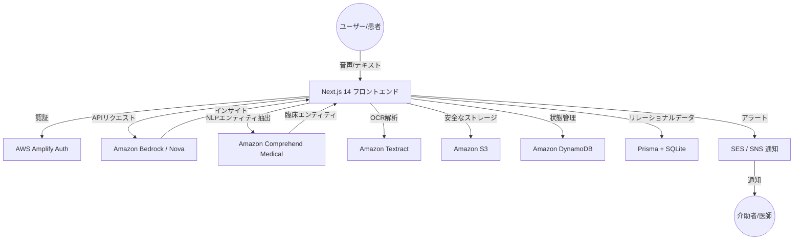

<div align="center">

<!-- アニメーションヘッダー -->


<!-- 言語切り替え -->
[ 🇬🇧 English ](README.md) | [ 🇯🇵 日本語 ](README_JP.md)

<br />

<!-- テクノロジーバッジ -->
[](https://nextjs.org/)
[](https://react.dev/)
[](https://www.typescriptlang.org/)
[](https://aws.amazon.com/bedrock/)
[](https://aws.amazon.com/dynamodb/)
[](https://www.prisma.io/)

<br />

<p>
  <b>Mimamori AI</b> は、診察の合間に生じる<b>「臨床データの空白（Clinical Data Gap）」</b>を埋める、プロアクティブなヘルスケア・モニタリングプラットフォームです。日常の音声ログを<b>医師が活用可能な臨床的インサイト</b>に変換し、リアルタイムのAI合成とスマートアラートを通じて、患者の自己管理を支援し、介助者に安心を提供します。
</p>

<br />

<!-- アクションボタン -->
[](https://mimamori-ai.com/)
[](https://github.com/shafayatsaad/mimamori)
[](https://builder.aws.com/content/3AAMRb7lRzAJnleldfYBBtfM1WG/aideas-transforming-healthcare-into-ai-powered-wellness-companion)

</div>

---

## 📋 目次

- [🎯 概要](#-概要)
- [🚨 臨床データの空白（課題）](#-臨床データの空白（課題）)
- [✨ 主要機能](#-主要機能)
- [🏗️ システムアーキテクチャ](#️-システムアーキテクチャ)
- [🛠️ 技術スタック](#️-技術スタック)
- [🚀 セットアップ方法](#-セットアップ方法)
- [🤖 AIエージェントエコシステム](#-aiエージェントエコシステム)
- [👥 チーム](#-チーム)

---

## 🎯 概要

**Mimamori（みまもり）** は、慢性疾患や日常の健康状態のモニタリング方法を革新するために構築されました。**AWS Bedrock** と **Kiro IDE** を活用して開発されたこのプラットフォームは、患者が診察室の外で過ごす99.9%の時間を「データのブラックボックス」にさせません。

### なぜ Mimamori なのか？

- 🎙️ **音声ファースト**: タイピングの手間なく、自然な会話で症状を記録。
- 🧠 **医療インテリジェンス**: Amazon Comprehend Medical を使用して臨床エンティティを抽出。
- 🔔 **予防的な安全性**: 健康トレンドに悪化の兆候が見られた際にスマートアラートを受信。
- 👨‍👩‍👧 **ケアサークル**: 家族、介助者、医師を一つのダッシュボードでシームレスに接続。

---

## 🚨 臨床データの空白（課題）

現代のヘルスケアは、エピソード的（断続的）かつ反応的なものになりがちです。Mimamori は現在のケアモデルにおける重要な断絶を解消します：

| 課題 | 影響 | Mimamori の解決策 |
|------|------|-------------------|
| ❌ **断続的なケア** | 診察の合間の重要な症状を見逃す | 音声による**継続的なログ記録** |
| ❌ **想起バイアス** | 医師に症状を正確に伝えるのが困難 | **合成されたPDFレポート** |
| ❌ **介助者の孤立** | 家族がリアルタイムの状況を把握できない | **共有ケアサークルダッシュボード** |
| ❌ **非構造化データ** | 健康日記が整理されず分析が困難 | **Comprehend Medical によるNLP抽出** |

---

## ✨ 主要機能

| 機能 | 説明 |
|------|------|
| 🗣️ **音声症状ログ** | 日常のニュアンスを理解するAI駆動の音声キャプチャ。 |
| 🧬 **臨床データ合成** | 処方薬、疾患名、バイタルサインの自動抽出。 |
| 📑 **医師向けレポート** | トレンドが可視化された包括的なPDF健康サマリー。 |
| ⚠️ **スマートアラート** | 脈拍や酸素飽和度の異常、悪化トレンドをリアルタイム通知。 |
| 🛡️ **ヘルスボルト** | Textract を介した検査結果や処方箋の暗号化保存。 |
| 🤝 **ケアサークル** | 患者を支えるネットワーク全体での透明性の高いモニタリング。 |

---

## 🏗️ システムアーキテクチャ



---

## 🛠️ 技術スタック

| レイヤー | 使用技術 | 用途 |
|---------|----------|------|
| **フロントエンド** | Next.js 14 (App Router) | コア・アプリケーション・フレームワーク |
| **ロジック** | React 18 + TypeScript | コンポーネントおよび状態ロジック |
| **スタイリング** | Tailwind CSS | モダンなグラスモーフィズムUI |
| **アニメーション** | Framer Motion | 滑らかな遷移とマイクロインタラクション |
| **AIエンジン** | Amazon Bedrock (Nova Micro/Pro) | 主要なLLM推論 |
| **医療用NLP** | Amazon Comprehend Medical | 臨床エンティティ抽出 |
| **ドキュメントAI** | Amazon Textract | 医療文書のOCR解析 |
| **データベース** | DynamoDB + Prisma (SQLite) | データの永続化 |
| **メッセージング** | Amazon SES / SNS | スマートアラートおよび通知 |

---

## 🚀 セットアップ方法

### 前提条件

- Node.js 18以上
- AWS アカウント (Bedrock, DynamoDB へのアクセス権限)
- Prisma CLI

### インストール

```bash
# リポジトリをクローン
git clone https://github.com/shafayatsaad/mimamori.git
cd mimamori

# 依存関係をインストール
npm install

# 環境変数の設定
cp .env.example .env.local
```

### 開発環境の起動

```bash
# Prisma クライアントの生成
npx prisma generate

# 開発サーバーの起動
npm run dev
```

_アプリケーションは `http://localhost:3000` で利用可能になります。_

---

## 🤖 AIエージェントエコシステム

Mimamori はマルチエージェント・オーケストレーションシステムを採用しています：

1. **ダイアリー・エージェント**: 音声ログをキャプチャし、適切なハンドラーにルーティングします。
2. **臨床抽出エージェント**: Comprehend Medical を使用して、未加工のテキストを医療オントロジーに構造化します。
3. **アラート・スペシャリスト**: 日常のバイタルをベースラインと比較し、異常時にSNSアラートをトリガーします。
4. **合成エージェント**: 臨床レビュー用の専門的なサマリーを生成します。

---

## 👥 チーム

<div align="center">
<table>
<tr>
<td align="center">
  <a href="https://github.com/shafayatsaad">
    
    <br />
    <strong>Shafayat Saad</strong>
  </a>
  <br />
  <sub>フルスタックデベロッパー</sub>
  <br /><br />
  <a href="https://github.com/shafayatsaad">
    
  </a>
  <a href="https://www.linkedin.com/in/shafayatsaad/">
    
  </a>
</td>
</tr>
</table>
</div>

---

<div align="center">

<!-- フッター -->


**AIdeas Healthcare ハッカソンのために ❤️ を込めて開発**

[](https://mimamori-ai.com/)

</div>
